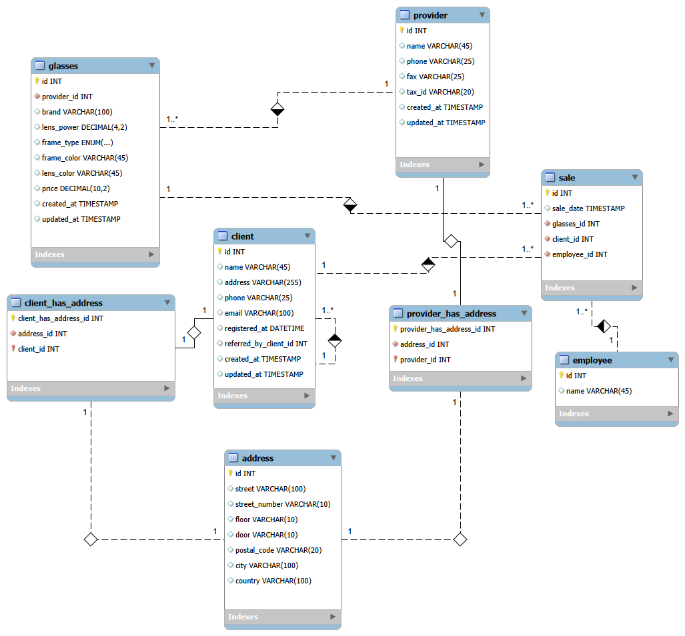
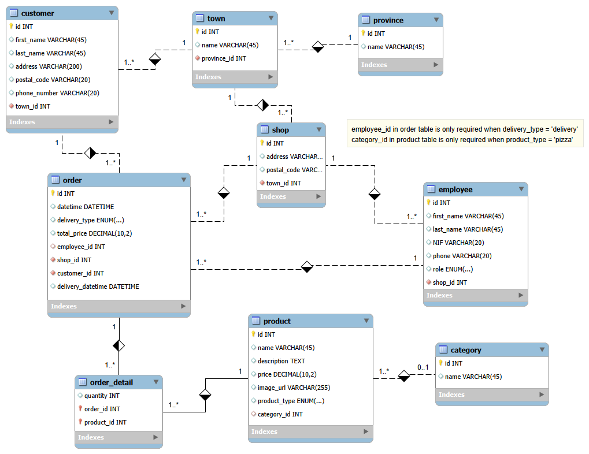
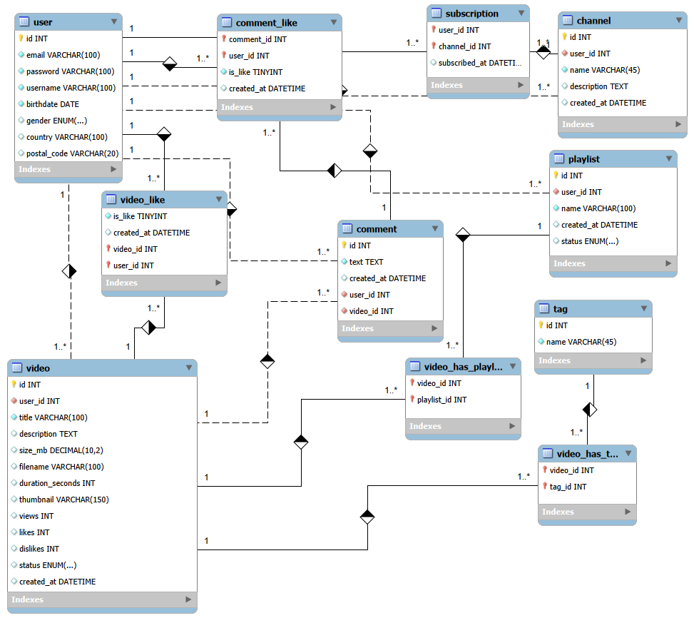
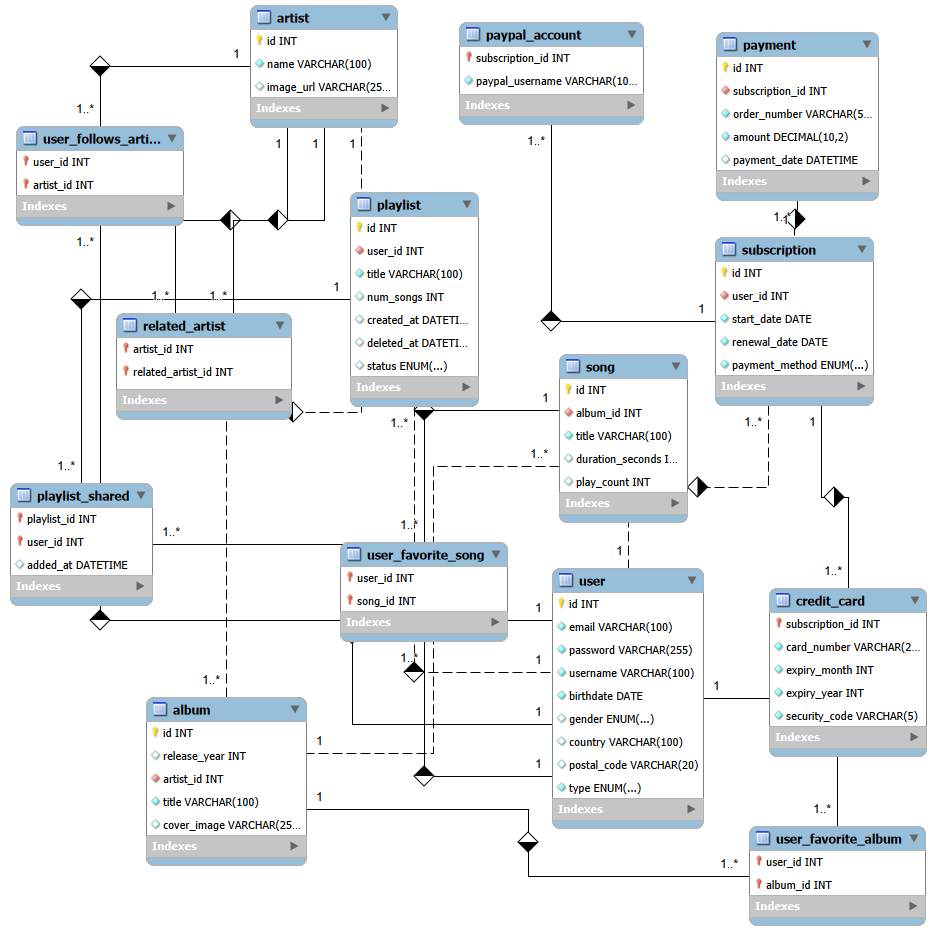

# 2.01-MySQL-data-structure

## 📄 Description

This repository contains multiple MySQL databases (ex1, ex2, ex3, ex4) with pre-defined schemas and sample data.
Docker Compose is used to set up and run all databases easily, ensuring anyone can start the databases 
**without installing MySQL locally.**

The SQL scripts are stored in the sql/ folder and are automatically executed when the Docker containers are initialized.
Additionally, this repository contains example SQL queries **(sql/queries.sql)** designed to test the ex1 and ex2 databases.

## Database Diagram

### ex1 - Sales Database

### ex2 - Orders and Products Database

### ex3 - YouTube-like Database

### ex4 - Spotify-like Database


## 💻 Technologies used

- MySQL 8.x
- MySQL Workbench
- Docker 28.x
- Docker Compose 2.x
- IntelliJ IDEA
- Adminer (for database management in browser)
- SQL scripts for schema and data initialization

## 📋 Requirements

- Docker installed and running
- Docker Compose installed (comes with Docker Desktop)
- IDE capable of handling SQL projects (e.g., IntelliJ IDEA)
- Optional: Adminer or MySQL Workbench to explore the databases

## 🛠️ Installation

1. Clone the repository:

```bash
git clone https://github.com/ccasro/2.01-MySQL-data-structure.git
```

2. Open the project in your IDE (e.g., IntelliJ IDEA)
3. Ensure the sql/ folder contains all SQL scripts.
4. Create a .env file in the project root (next to docker-compose.yml) with the following template:
```env
# Database settings
MYSQL_DATABASE=ex1
MYSQL_USER=miuser
MYSQL_PASSWORD=yourpassword
MYSQL_ROOT_PASSWORD=rootpassword

# Host ports
HOST_MYSQL_PORT=3306
HOST_ADMINER_PORT=8080
```
5. Make sure Docker Desktop is running and the Docker daemon is active.

## ▶️ Execution

1. Open a terminal in the project root folder
2. Run Docker Compose to start the MySQL databases:
```bash
docker compose up -d
```
3. Docker will:
    - Create containers for MySQL and Adminer
    - Initialize the databases with schemas and sample data automatically from sql/
    - Expose MySQL ports (default 3306) and Adminer (default 8080)
   
4. Access the databases:
   - Adminer: http://localhost:8080
     - Server: db
     - User: miuser
     - Password: as defined in your .env file
     - Databases: ex1, ex2, ex3, ex4
5. To stop the containers:
```bash
docker compose down
```
## 🌐 Deployment

No production deployment is required. The setup is intended for local development and testing purposes using Docker

## 🤝 Contributions

- Use the main branch for development.
- Make small, frequent commits following Conventional Commits.
- Do not commit sensitive credentials or compiled files
- To propose improvements, create a branch and open a pull request.